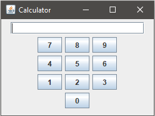

# Recursive-Descent-GUI-Parser
Generate GUI using a defined GUI grammar language and parses using recursive descent
Created for my class CMSC 330 - Advanced Programming Languages




GUI Grammar Language:
```
gui ::=
        Window STRING '(' NUMBER ',' NUMBER ')' layout widgets End '.'
    layout ::=
        Layout layout_type ':'
    layout_type ::=
        Flow |
        Grid '(' NUMBER ',' NUMBER [',' NUMBER ',' NUMBER] ')'
    widgets ::=
        widget widgets |
        widget
    widget ::=
        Button STRING ';' |
        Group radio_buttons End ';' |
        Label STRING ';' |
        Panel layout widgets End ';' |
        Textfield NUMBER ';'
    radio_buttons ::=
        radio_button radio_buttons |
        radio_button
    radio_button ::=
        Radio STRING ';'
```

Input File:
```
Window "Calculator" (200, 200) Layout Flow:
	Textfield 20;
	Panel Layout Grid(4, 3, 5, 5):
		Button "7";
		Button "8";
		Button "9";
		Button "4";
		Button "5";
		Button "6";
		Button "1";
		Button "2";
		Button "3";
		Label "";
		Button "0";
	End;
End.
```